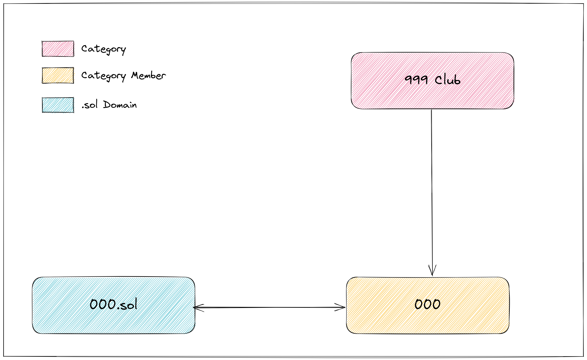

<h1 align="center">SNS Categories</h1>
<br />
<p align="center">

</p>
<p align="center">
<a href="https://twitter.com/bonfida">

</a>
</p>
<br />

<p align="center">
<strong>
Create, manage and interact with SNS Optics categories on-chain
</strong>
</p>



<br />
<h2 align="center">Introduction</h2>
<br />
SNS Categories is a Solana program for managing SNS Optics categories. It provides functionalities to create a new category, add members to an existing category, and remove members from a category. It's currently in beta and open for contributions from the community.

<br />
<h2 align="center">Features</h2>
<br />

- **Create category:** Enables the creation of a new category on Solana Name Service.
- **Add member:** Allows the addition of a new member to an existing category.
- **Remove member:** Allows the removal of a member from an existing category.

### How can I verify that a domain belongs to a category?

Belonging to a category is equivalent to the category member being a child (or subdomain) of the category metadata. In order to check if a .sol domain is part of a category, you need to follow these steps:

1. Derive the category public key: You can derive the category public key by using the category name and the appropriate hashing method provided by the program

2. Derive the category member public key associated with the domain: You can derive the category member public key by using the domain name and the category public key obtained in the previous step

3. Check the on-chain data: Query the on-chain data for the derived category member public key. If the account is present, it indicates that the domain is part of the category.

### How can I get all the members of a category?

All members of a category can be retrieved via a `getProgramAccount` RPC request and the following filters:

```js
  const filters: MemcmpFilter[] = [
    {
      memcmp: {
        offset: 0,
        bytes: category.toBase58(),
      },
    },
    {
      memcmp: {
        offset: NameRegistryState.HEADER_LEN,
        bytes: ((Tag.CategoryMember as number) + 1).toString(),
      },
    },
  ];
```

### How can I get all the categories?

All categories can be retrieved via a `getProgramAccount` RPC request and the following filters:

```js
const filters: MemcmpFilter[] = [
  {
    memcmp: {
      offset: 0,
      bytes: CATEGORY_TLD.toBase58(),
    },
  },
  {
    memcmp: {
      offset: NameRegistryState.HEADER_LEN,
      bytes: (Tag.CategoryMetadata + 1).toString(),
    },
  },
];
```

## Reproducible build

A reproducible build script (`build.sh`) can be used to build the program using docker

## Security

For security disclosures or to report a bug, please visit [ImmuneFi](https://immunefi.com/bounty/bonfida/) for more information on our bug bounty program.
